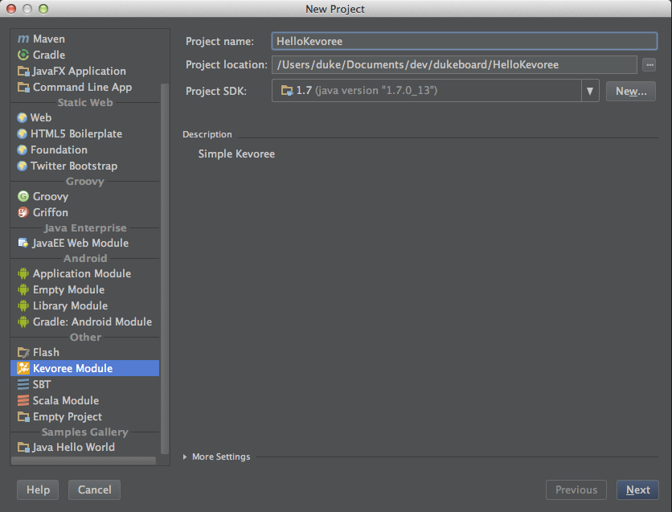
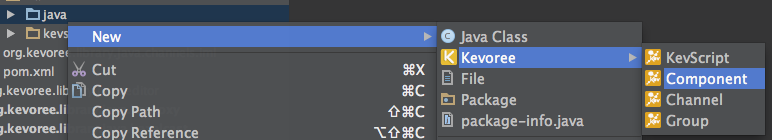

Getting started with Kevoree IntelliJ Plugin 
---------------

### Installation
Kevoree Plugin is distributed through IDEA repository like any other plugins. It is available since IntelliJ 13.

* At startup screen
* Naviguate to configure menu
* Naviguate to plugins menu
* Click on Browse repositories button
* Select Kevoree plugin, click on apply and reload.

> 

 
Create a new project
---------------

### Wizard

* Naviguate to menu NEW
* Select Kevoree Module
* Give a name
* Give a target file directory for creation
* Click on next
* Optionally click on refresh project in Maven Menu

> 

Create a new Kevoree entity
---------------

First of all, Kevoree new wizard only work when a source repository is selected. So naviguate to src for instance and right click on it.

### Component / Channel / Group

* Right click on source directory
* Select Kevoree sub menu
* Create a Component / Channel / Group

> 

### KevScript

* Right click on source directory
* Select Kevoree sub menu
* Create a KevScript

> 

Run Kevoree platform
---------------

KevScript files describe configurations. 
Kevoree platform can then bootstrap on this configuration.
This plugin allows you to right click on any .kevs file to directly start a test platform into your IntelliJ through run menu.

> 

Two kind of runner are available:

* Dev: this runner bootstrap with Java code from your IDE. This is the most efficient way to test the component you are developing. In addition, this runnner automatically add your type definitions from your project directly available in your KevScript, so if you forgive include statement it will have no impact. In short modify the code, run again and you will see immediatly the modification. We rely on the incremental compilation of IntelliJ.
* Prod: this runner is a plain Kevoree platform, so it take and code from type definitions from maven. This mean that you have to do mvn insall before running. 

After run you should see the resulting console result. Then you are able to start quickly your code as fast as a main method.

> 

