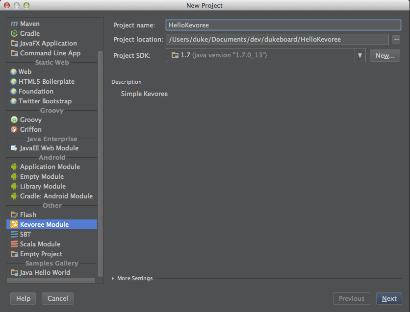
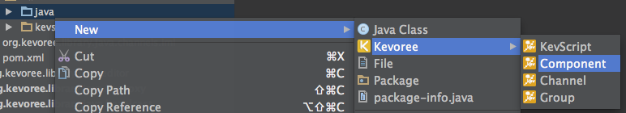

Getting started with Kevoree IntelliJ Plugin 
---------------

### Installation
Kevoree Plugin is distributed through IDEA repository like any other plugins. It is available since IntelliJ 13.

* At startup screen
* Naviguate to configure menu
* Naviguate to plugins menu
* Click on Browse repositories button
* Select Kevoree plugin, click on apply and reload.

> 

 
Create a new project
---------------

### Wizard

* Naviguate to menu NEW
* Select Kevoree Module
* Give a name
* Give a target file directory for creation
* Click on next
* Optionally click on refresh project in Maven Menu

> 

Create a new Kevoree entity
---------------

First of all, Kevoree new wizard only work when a source repository is selected. So naviguate to src for instance and right click on it.

### Component / Channel / Group

* Right click on source directory
* Select Kevoree sub menu
* Create a Component / Channel / Group

> 

### KevScript

* Right click on source directory
* Select Kevoree sub menu
* Create a KevScript

> 

Run Kevoree platform
---------------

TODO

