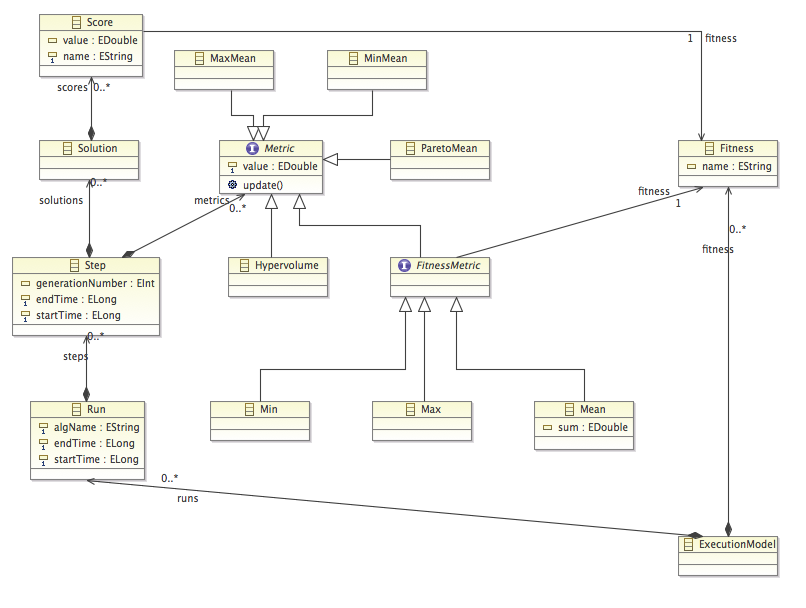

Polymer Framework
=======
# Introduction
Multi-objective optimization is applied to several software applications domains to solve problems in which solutions have to achieve trade-offs between conflicting objectives.
Cloud infrastructure management leaverages multi-objective optimization to solve for example the trade-offs between cost and performance.
Such problems are complex in terms of data representation and in terms of problem parameters encoding. 
The polymer framework builds an optimization layer on the top of your models to give you a support for runtime optimization.

#  Polymer & Models Optimization Support
To design a specific domain, people rely on modeling to represent the different concepts that are pertinent for a given domain.
Models@runtime enable to reduce the software complexity by providing a layer that permits to represent the system while it is in a running state. Polymer propones an optimization layer on the top of models to optimize systems while they are in a running state.
We build KMF framework, to have a efficient modeling layer for runtime usage.
The Polymer framework is built upon KMF framework and aims at achieving optimization on any KMF compliant model, expressed in MOF concepts.
Polymer supports current MOEA (Multi-objective Evolutionary Algorithms), and proposes a new hyper-heuristic that works on top of MOEA for runtime concerns.
> Polymer framework is dedicated to perform multi-objective optimization on top of MOF compliant models.

# Optimization Constraints 

# and run.time constraints
# Basic Concepts
##  MOEA: Multiobjective Evolutionary 
## Algorithms (MOEAs)
Multi-objective evolutionary algorithm (MOEA) are driven by elitism rules that favor the survival of strongest species in analogy to natural selection. 
Applied to software engineering, species are candidate solutions to complex optimization problem, these solutions constitute what is called a generation.
MOEA are based on an iterative search in which a set of individuals is selected and mutated in each iteration to constitute a new generation.
MOEA algorithms leverage an evolution principle based on Darwinian rules that try to derive from an initial population of solution, solutions combining acceptable trade-offs between objectives. 
##  Population
An evolutionary algorithm maintains a set of candidate solutions called a population. 
##  Fitness Functions
Fitness functions are used to evaluate solutions to solve a specific optimization problem, in analogy 
to natural selection where species qualities are evaluated according to their surrounding context. 
##  Operators
Genetic operators are used to emulate natural mutation in order to generate a new generation composed of mutated solutions.
We distinguish between 3 genetic operators:
###  Mutation Operators
Mutation operators introduce small changes with a small probability to preserve the population diversity 
###  Crossover Operators
Crossover operators create new individuals by genetic recombination.
###  Selection Operators
Selection operators choose an individual from the current generation’s population for inclusion in the next generation’s population. 
##  SPUTNIK
Hyper-heuristics are self-tuning heuristics that are based on parameters adaptation during optimization processing. 
In general, hyper-heuristics introduce modifications on the algorithm itself, in order to improve its efficiency to handle a specific purpose.
Sputnik hyper-heuristic leverages a continuous ranking of operators according to their impact on fitness functions to smartly select dynamically the mutation operators according to the problem to solve.
We focus on performance as a key factor for runtime usage to reach faster acceptable trade-offs while saving computation time and generation cycles. For instance, the acceleration Sputnik provides is useful for adaptive systems when a solution/reaction has to be found in a short time.
# Polymer Configuration
The following steps show how to configure a Polymer engine.
##  Creating a model

> The example below shows an example of model creation:
***************
```
public class CloudPopulationFactory implements PopulationFactory<Cloud> {
    @Override
    public List<Cloud> createPopulation() {
        ArrayList<Cloud> populations = new ArrayList<Cloud>();
        for (int i = 0; i < size; i++) {
            Cloud cloud = cloudfactory.createCloud();
            for (int j = 0; j < 50; j++) {
            VirtualNode myAmazonEC2node = cloudfactory.createAmazon();
            VirtualNode myRackspacenode = cloudfactory.createRackspace();
            Software web = cloudfactory.createSoftware();
            web.setName("web");            
            web.setLatency(100.0);            
            myAmazonEC2node.setId("EC2_"+j);
            myAmazonEC2node.setPricePerHour(10.0);
            myAmazonEC2node.addSoftwares(web);
            cloud.addNodes(myAmazonEC2node);  
            myRackspacenode.setId("Rack_"+j);
            myRackspacenode.setPricePerHour(5.0);
            myRackspacenode.addSoftwares(web);
            cloud.addNodes(myRackspacenode);          
            }
            populations.add(cloud);
        }
        return populations;
    }
}
```  

##  Configuring a Fitness Function

> The example below shows an example of model creation:
***************
```
public class CloudCostFitness implements FitnessFunction<Cloud> {
    @Override
    public double evaluate(Cloud model, GenerationContext<Cloud> cloudGenerationContext) {
        double pres = 0;
        for(VirtualNode node : model.getNodes())
        {
            if ((node instanceof  Amazon) || (node instanceof  Rackspace)  )
            {
                //System.out.println(node.getId());
                pres=pres + node.getPricePerHour();
            }
        }
        return ((pres / (model.getNodes().size()*10)));
    }
   }   
``` 
##  Configuring an operator

> The example below shows an example of model creation:
***************
```
public class AddNodeMutator implements MutationOperator<Cloud> {
    private Random rand = new Random();
    private DefaultCloudFactory cloudfactory = new DefaultCloudFactory();
    @Override
    public List<MutationVariable> enumerateVariables(Cloud cloud) {
    return Arrays.asList((MutationVariable) new QueryVar("target", "nodes[*]"));
    }
    @Override
    public void mutate(Cloud parent, MutationParameters mutationParameters) {
        int i = rand.nextInt(1);
        if (i==0)
        {
        VirtualNode node = cloudfactory.createAmazon();
        node.setId("EC2_"+Math.abs(rand.nextInt()));
        node.setPricePerHour(10.0);
        parent.addNodes(node);
        }
        else
        {
        VirtualNode node = cloudfactory.createRackspace();
        node.setId("Rack_"+Math.abs(rand.nextInt()));
        node.setPricePerHour(5.0);
        parent.addNodes(node);}
    }
}
``` 

##  Generation Number Setup
##  MOEA Algorithm Setup
The following section demonstrates how to configure an MOEA resolution engine.
###  Adding an operator
We start by configuring the engine with the different operators.

> The example below shows an example of model creation:
***************
```
  engine.addOperator(new AddNodeMutator());
  ```

###  Adding a fitness function
***************
```
   engine.addFitnessFuntion(new CloudCostFitness());
  ```
The engine is configured later with the defined fitness functions
 

###  Setting a mutation strategy
The mutation strategy is defined. 
The framework supports the following mutation selection strategies: the random muation selection strategy, SPUTNIK_ELITIST selection strategy. 
  
  ***************
```
    engine.setMutationSelectionStrategy(MutationSelectionStrategy.SPUTNIK_ELITIST);
  ```

###  Setting a generation number

The setMaxGeneration method defines the generation number.   
  ***************
```
     engine.setMaxGeneration(300);
  ```


###  Setting a population size
 The setPopulationFactory method defines the population size. 
   ***************
```    
 engine.setPopulationFactory(new CloudPopulationFactory().setSize(10));
  ```
###  Setting an MOEA Algorithm             
The setAlgorithm method defines the algorithm considered. 

Polymer framework considers the following algorithms: NSGA II, NSGA II with Hypervolume, epsilon-MOEA
  
 ***************
 ```    
 engine.setAlgorithm(GeneticAlgorithm.HypervolumeMOEA);
  ```
             
### Launching the resolution
The solve method launches the resolution.

 ***************
 ```    
 List<Solution<Cloud>> result = engine.solve();
  ```
  

### Putting All together

Once all the parameters that are needed for the resolution are configured, the algorithm looks like the following:

 ***************
 ```    
 GeneticEngine<Cloud> engine = new GeneticEngine<Cloud>();
        engine.setAlgorithm(GeneticAlgorithm.EpsilonCrowdingNSGII);
        engine.addOperator(new AddNodeMutator());
        engine.addOperator(new RemoveNodeMutator());
        engine.addOperator(new AddSoftwareMutator());
          engine.addOperator(new CloneNodeMutator());
        engine.addOperator(new RemoveSoftwareMutator());
        engine.addOperator(new AddSmartMutator());
        engine.addOperator(new RemoveSmartMutator());
        engine.addFitnessFuntion(new CloudCostFitness());
        engine.addFitnessFuntion(new CloudSimilarityFitness());
        engine.addFitnessFuntion(new CloudLatencyFitness());
        engine.addFitnessFuntion(new CloudRedundancyFitness());
        engine.setMutationSelectionStrategy(MutationSelectionStrategy.SPUTNIK_ELITIST);
        engine.setMaxGeneration(300);
        engine.setPopulationFactory(new CloudPopulationFactory().setSize(10));
        engine.setAlgorithm(GeneticAlgorithm.HypervolumeMOEA);
  ```
# Charts Generation

Polymer enables users to generate output results into CSV files or html files.

To facilitate results usage, we have defined the following metamodel.

The metamodel is shown in the Figure below:

To initiate the execution model:


```   
     ExecutionModel model = engine.getExecutionModel();
```

To generate CSV files, we add the following methods:


```   
     ExecutionModelExporter.instance$.exportMetrics(model,new File("results"));
```

    

To be able to generate html files, we add the following lines:


```   
      Server.instance$.serveExecutionModel(model);
```

> [Figure 1: Execution Model metamodel](id:metamodel)
> 


   


 
 * Open the **Scaler** sample project in your IDE.
* You'll find a `src/main/kevs/main.kevs` which corresponds to the initial model
*  *Kevoree Runtime*

        
               
                


