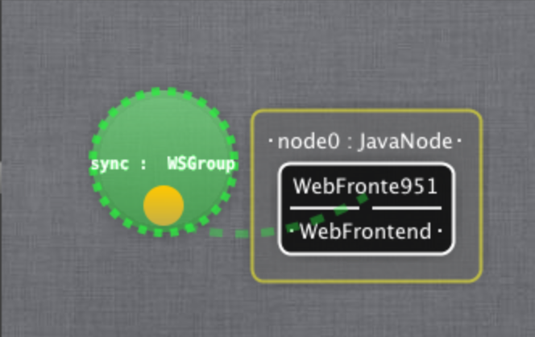

Cloud and reactive elasticity
---------------

This last practice level introduces the Cloud aspect of Kevoree framework.    
In previous levels, you have edited and played with components, channels, and learnt how to manipulate models and the underlying system using the KevScript DSL.    
This practice extends the *Level 3* (which defines elasticity mechanism for WebServers, on a single machine) to allow you to build your own cloud and your own elasticity mechanism inside.

### Objectives

The main goal in this practice is to make you confident in creating and managing virtual machines through Kevoree node encapsulation concept. After a learning phase of how to create and visualize virtual machines, you will have to write a componant aiming at managing a cluster of machine behind a load balancer. In details, the goal of this managament is to constantly adapt the number of running machines to the load.

### Setting up your environment

As in previous pratice levels, this tutorial requires a Kevoree runtime of your choice (i.e. GUI, prompt, standlane, KevScript maven runner...), an editor and a modern browser supporting WebSocket (e.g. Firefox, Chrome, Chromium, Safari).

Step 1 Cloud nodes
---------------

First of all, you should be confident in how to create virtual machines in Kevoree framework. This is performed through the creation of child nodes and the attachement of such node to a container. By this encapsulation we can mimic the fonctionnality of a cloud which define a infrastructure level (nodes hosting only nodes) and a platform level (nodes which contains at least one component).

First of all, start the runtime of your choice. Then open a Kevoree Editor an load the current model of the runtime. Find below main steps:

* Load the model from your node : `File / Load model from node`
* Load the Cloud Web library through : `Model / Load Library / Cloud / org.kevoree.library.cloud.web`
* Drag and drop a WebFrontend component in your node
* Deploy the new model on your node : `click on node` then `click button push`

Your model should look like the following picture. 

> [Figure 1: The Kevoree Cloud web frontend](id:fig-runtime)
> 

You should see a message : `Update sucessfully completed` in your runtime.

>Open a browser, a type the following url  
***************
```
http://localhost:8080
```

You are now visualizing a web interface dedicated for Cloud node management. It is simply a strict vizualization of the current model and each time a modification is performed, the modified model is send to the platform to application.

***Add a child node from the web interface***    
The *add default* button allows you to quicly add a child node to the current platform hosting the web interface. Because you certainly start your container as a JavaNode (by default), the child node will run in a separated Java virtual machine. As a reminder Kevoree node type (e.g. JavaNode) defines the kind of virtualization strategy to adopt for child node isolation. We offer extactly the same API for concret hypervisor like LXC, Docker, KVM, Amazon EC2,...

After adding a new node you can redo the step `open from node` on editor and observe that the current model reflects the augmented set of nodes. 

***Add a child node from KevScript***    
Similarly you can now modify the model from the editor, open the KevScript panel and type 

```
add node0.newKChild : JavaNode
```

or simply drag and drop a JavaNode inside the node0 and add a HelloJava component for instance.

Then execute and push your model to the platform, you will observe the creation of a node and the start of the hosted component.

Step 2
---------------
In this last section, you will extend the step 3 of level 3. As a reminder, this previous work aimed at deploying a Scaler component which manage the number of Web server replicat inside a node. Replicat is then accessible behind a load balancer which balance the load using a round robin strategy. The current step simply aims at performing a similar process but in addition you need to **isolate** each web server in a **dedicated child node**. Finally for stronger developpers you can extends this cloud scaler manager with a property wich dynamically choose to put several instances on the same nodes.
#### Scaling Web services using child nodes                                                                                                                                                                                                                                                                                                                                                                                                                                                                                                                                                                                                                                                                                                                                                                                                                                                                                                                                                                                                                    

The easiest initial step is to use the CloudScaler sample project (github kevoree-samples).
Here is the following steps :

* Open in the IDE of your choice the Scaler sample project.
* Extend the reaction of add and remove nodes if necessary with a child node step and an attachement of the new components to this nodes. As a reminder to add a node you should use the following KevScript instruction : `add parent.child : JavaNode` , similarly to attach the  BlogServer to a child node simply use `add child.componentName : BlogServer`.
* Start a runtime and deploy an instance of your scaler inside the root `node0` (or use the kev:run technics for similar behavior).
* Use the editor to change the number of needed instance of Web server
* Test an play with it :-)

#### Dynamic reallocation of WebServers

Indeed isolate each WebServer in a separated virtual machine is costly. Why not being more flexible and allow to add a number of maximum WebServer to run on the same virtual machine ?

* Add a dynamic param to your scaler which will be ne number of maximum WebServer which can be host on the same virtual machine
* In the update method (called when you will update this param), define a code to move WebServer components over the limit in other containers. As a reminder you should use the `move` instruction of KevScript `move child3.web3 child4`.
* Use the same testing strategy than the previous step
* Use the editor to make vary the parameter, you should observe node and components moving.

That's all folks ! We hope that you enjoy developping using Kevoree, now you have every tools to define you own complex dynamic system using Model@Run.time concepts. Don't hesitate to contact the Kevoree team by mail or github if you have any question or issue.


